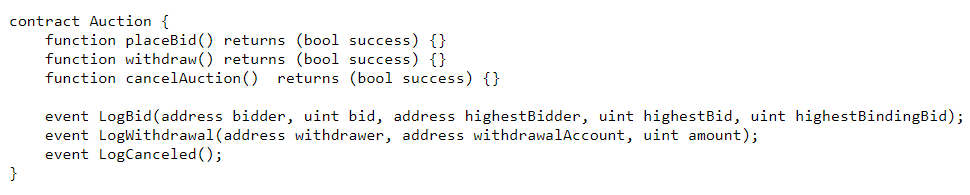
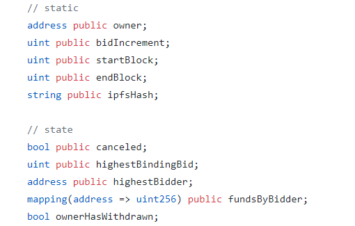
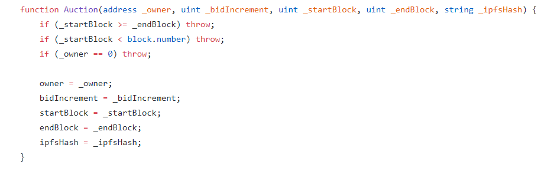
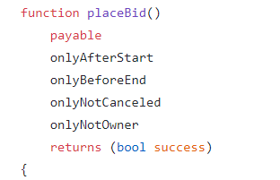
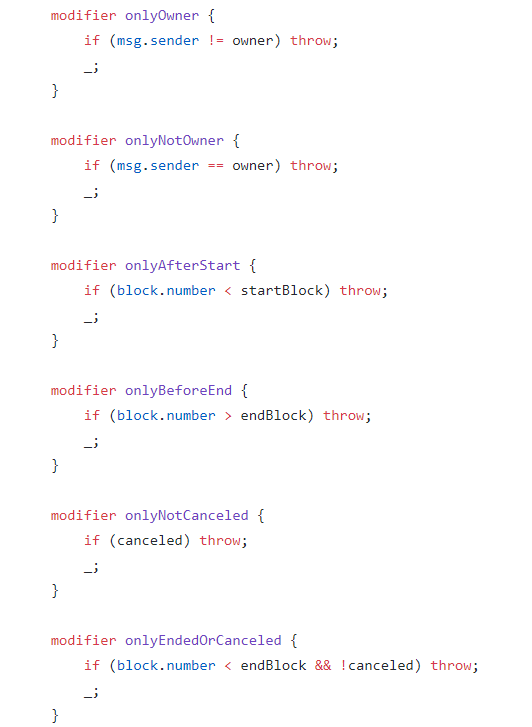
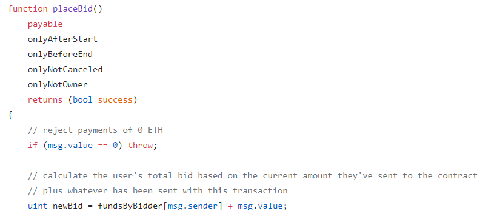
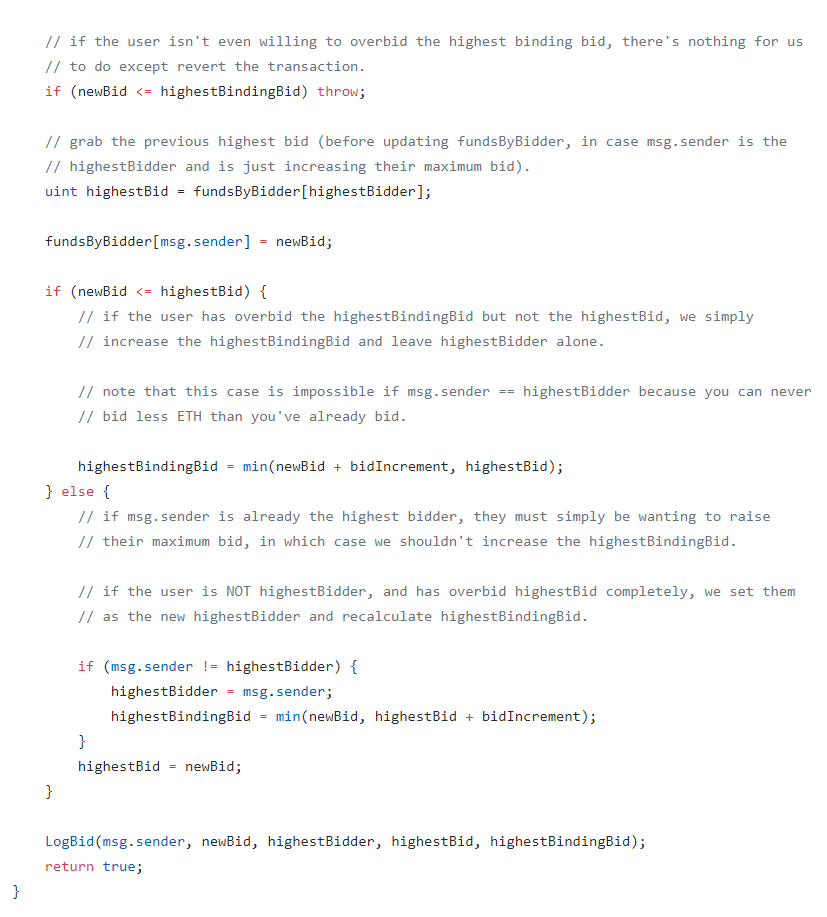

# Solidity: building a simple auction contract

The Auction contract is in the contracts folder.

## Start with the interface

Our auction contract will have a simple interface that allows users to place bids and, after the auction is complete, withdraw their funds. The owner of the auction needs to be able to cancel the auction in exceptional cases, and must also be allowed to withdraw the winning bid.
We have settled on the following interface, which should provide just enough expressiveness to handle this functionality. Notice that this is also a good time to think about the events that we might want these functions to emit.

## Plan your storage variables

Let’s also spend a bit of time thinking about what kinds of storage variables we want to keep on hand. Here’s what we came up with. Notice that we have informally separated these into “static” data, which doesn’t change over the life of the contract, and “state” data, which does.

Some of these are self-explanatory, like canceled and fundsByBidder. We’ll see how these are used when we start writing our contract’s functions. What about the rest?
Every auction needs an owner — the person to whom the winning bid will go if the auction completes successfully. If you were so inclined, you might want to separate out the “controller” (say, the person or contract that has permission to cancel the auction) from the “beneficiary” (the person or contract to whom the funds will go after the auction is over), but we will leave that as an exercise to the reader. For now, they’re one and the same.

Auctions also require a start and end time. Time in Solidity is a bit tricky — block timestamps are set by miners, and are not necessarily safe from spoofing. An emerging best practice is to demarcate time based on block number. We know with a fair amount of certainty that Ethereum blocks are generated roughly every 15 seconds; consequently we can infer timestamps from these numbers rather than the spoofable timestamp fields. Hence, startBlock and endBlock. If we build our UI correctly, this abstraction should be invisible to the user.

We have also included a field for storing an IPFS hash. The data referred to by this hash may contain things like the auction’s title and description, photo URLs, etc. Storing data in smart contracts can be very expensive. If you need to associate large amounts of metadata with your contract that isn’t critical to its business logic, it’s a much better idea to find an off-chain storage solution, and simply store a reference so that it can be retrieved separately. We’re not going to refer to the ipfsHash field in this project; it’s included as a reminder of proper contract/dApp architecture.

What about bidIncrement and highestBindingBid? It’s worth taking a moment to explain these. On many popular auction platforms, users are incentivized to bid the maximum they’re willing to pay by not binding them to that full amount, but rather to the previous highest bid plus the increment. That’s a mouthful, so let me give an example. Let’s say the current highest bid is $430, and the bidIncrement is $10. You decide to bid $500. However, you are only obligated to pay $440 (the current highest bid + bidIncrement) if you win the auction. In this case, $440 is the highestBindingBid. If someone comes along and bids $450, you will still be the highestBidder, but the highestBindingBid will be raised to $460. It’s sort of like asking the platform to automatically bid for you up to a given amount, after which point you’ll need to make a decision to raise your maximum bid or bow out. Just to be clear, anything you send in excess of highestBindingBid will be refunded to you when you win the auction.

## The constructor

Our constructor is extremely simple:

It checks some preconditions and then sets a few variables in the contract’s storage (namely, the ones we marked “static”).
We refuse to create auctions with invalid start and end times: the start time must be before the end time, and it must also be after the current block (in other words, you can’t create a new auction that started at some point in the past).
We also reject auctions with an empty owner parameter — funds would get locked in the contract and would be impossible to withdraw.

## Placing a bid

Before we sit down to start writing our placeBid() function, we should do a little bit of planning. We know that there are only certain cases in which it should be possible to place a new bid — it shouldn’t be allowed before the auction starts, after it ends, or if it’s canceled. We also know that it would be considered moral hazard if the auction’s owner were allowed to place bids (since he or she could run up the price, hoping for more profits). We need to make sure that placeBid() fails if these constraints aren’t met.

#### Implement preconditions with reusable function modifiers

This sounds like a list of preconditions — a perfect application of Solidity’s function modifiers. Let’s imagine we want to place the following constraints on our placeBid() function:

Take note of the fact that we err on the side of “many small modifiers”: each precondition is as minimal as possible. This makes our modifiers more reusable.

The optimal approach is to make each modifier as dead-simple as possible, with the aim of reusing them frequently:

#### Simple modifiers are best.

With our preconditions in place, let’s take a step back from the code for a moment to think about how placeBid() should actually work.
Users should be able to send ETH to this function, and depending on how much they sent, they will either become the highestBidder or will cause the highestBindingBid to increase.
Taking a first stab at an implementation, we might decide that there are a few cases where we want to refund someone’s ETH:

1. When the current highestBidder is outbid by someone else.
2. When someone places a bid greater than highestBindingBid but less than highestBidder's maximum bid.

This seems fair and intuitive, right? Why lock up someone’s funds if they aren’t the highestBidder?
Wrong.

#### Don’t proactively send, use the withdrawal pattern

We know from the DAO hack that it’s always best to stick to a “withdrawal” pattern — this helps us to avoid re-entrance bugs that could cause unexpected behavior (including catastrophic financial loss for our users). We should only send ETH to a user when they explicitly request it, and we should try to avoid doing much of anything else in that function.

For example, what would happen if a user sent a bid from a contract with a maliciously-crafted fallback function designed to expend all of the gas provided to it? That user could never be outbid, because when someone else tried to place a bid, the EVM would send ETH back to that malicious fallback function. The transaction would run out of gas, preventing the new user’s bid from being recorded.

So placeBid() should simply accept payments of ETH and then recalculate some of the contract’s storage variables, like highestBidder, fundsByBidder, and highestBindingBid. If a user is outbid, their ETH remains locked up in the contract for the time being. This is fine, because they can simply withdraw it manually when the auction ends.

#### The UI should bridge the gap between what the contract expects and what our users expect

There’s an unintuitive consequence of holding onto everyone’s ETH until the end of the auction, and we’ll have to make sure we handle it correctly. Namely, when a user has been outbid and wishes to raise their bid to become the highestBidder again, they only need to send enough ETH to bring their total over the current highest bid (because we’re still holding onto the funds from their previous bid). For example, you bid 70 ETH, and then someone else bids 80 ETH. To outbid them, you would only need to send an additional 10.000000000000000001 ETH the next time you call placeBid() (although you could certainly send more).

This seems strange on the surface — after all, when you’re bidding on a pair of ice skates on eBay, you express your bid using the full amount. If you bid $70, and someone else bids $80, you don’t bid “$20” to outbid them. You would probably type “$90” in the input field.
This is where it’s important to recognize the separation of concerns between the contract and the UI. Ideally, the UI is responsible for smoothing over this oddity; the contract’s job is simply to ensure that the business logic is executed securely and correctly, even if that business logic seems a little bit strange to human intuition.

So what does our placeBid() function look like? We don’t want to waste words here dissecting every line of the business logic, since the goal of this project is to address broader architectural patterns and concerns. For those interested in fine-grained detail, we have tried to annotate the code with comments where appropriate.

We are handling several scenarios here:
A user has sent an amount that isn’t sufficient, in which case we throw.
A user has sent an amount that’s higher than highestBindingBid but not higher than highestBid , in which case we simply increase highestBindingBid.
A user has sent an amount that’s higher than highestBid, in which case they become the new highestBidder.
The current highestBidder wishes to raise their maximum bid, in which case we accept their ETH, increment fundsByBidder[highestBidder], and do nothing to our other contract storage variables.

## Withdrawing funds after the auction

When the auction is over, whether it’s canceled or not, users should be able to withdraw the ETH that they used to place their bids.
Withdrawals should only be permitted after the auction has successfully ended (block.number > endBlock) or if it was canceled. Unfortunately, we’ll need a new function modifier for this, since the conditions are logically OR’ed together (chaining together small modifiers only works for AND’ed conditions).
Technically, since this precondition is only used once (here), we could simply hard-code it into the function, but for consistent style, we chose to encapsulate it into its own modifier:

There are several cases we need to handle, depending on which user is asking our contract for a withdrawal:
The owner should be able to withdraw an amount of ETH equal to highestBindingBid.
The highestBidder should be able to withdraw any ETH they sent in excess of highestBindingBid (in other words, their maximum bid minus highestBindingBid).
Any other user should be able to withdraw all of the ETH they sent.
Notice that we finally make use of our ownerHasWithdrawn storage variable so that we can correctly calculate how much to send to highestBidder. There are other ways to accomplish this, like storing highestBid as a storage variable — for our purposes, it doesn’t matter much.

Notice that we’re following the recommended pattern for functions that send ETH:
1. Check our preconditions.
2. Do “optimistic accounting” (i.e., we do our accounting assuming that the transaction will succeed).
3. Send ETH, and throw if the send fails (throw will roll back our optimistic accounting in that case).
4. Log an event and return.

## Canceling the auction

Luckily, our cancelation function is much simpler than the others. We can make do with the following:

We simply set our canceled storage variable to true, log an event, and return.
It’s worth pointing out that we’ve been able to reuse several of our function modifiers here. Right on! In larger contracts, the benefits of these “micro-modifiers” will be even more apparent.

## Wrapping up

Well, there you have it — a decentralized eBay in ~167 lines of Solidity. Unlike other platforms that you might be used to, writing Solidity contracts generally involves very little code, but an enormous amount of attention to detail. Security, gas costs, and readability are all incredibly important considerations, and until we have better analysis tools, much of this work is left to the programmer.
